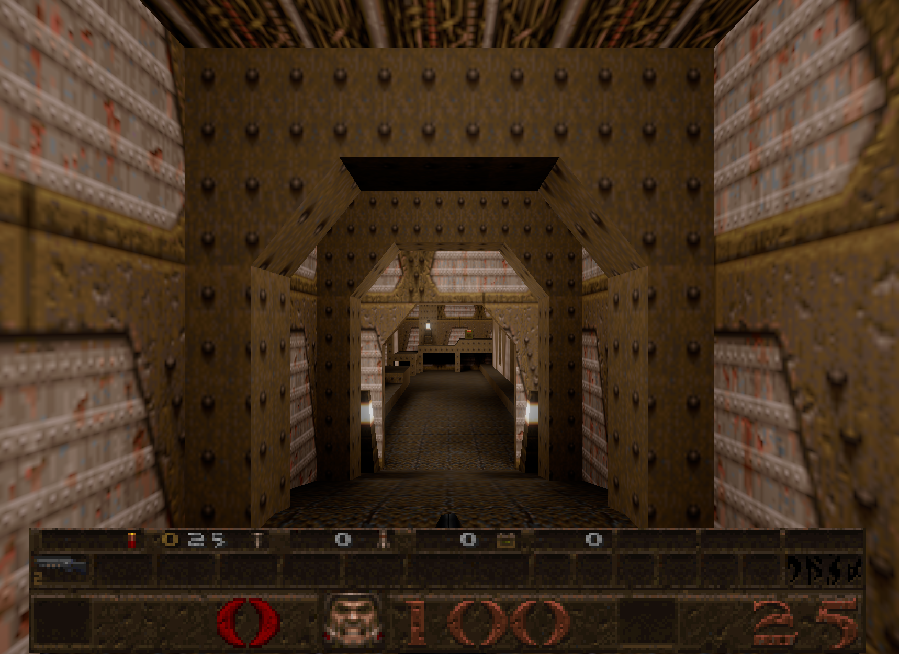
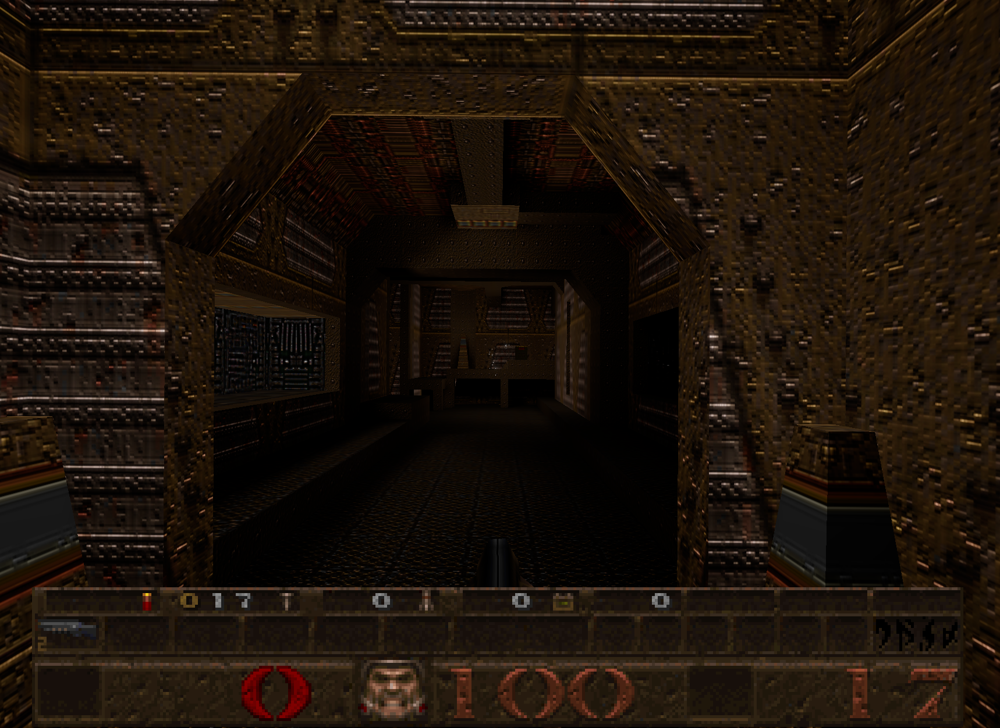

# Texture Enhancement System

Three-Quake includes an intelligent texture enhancement system that analyzes original Quake textures to extract intrinsic properties and uses them for high-quality upscaling.

## How It Works

The system performs **intrinsic image decomposition** on each texture:

1. **Light Direction Detection** - Analyzes shadow/highlight patterns to determine the baked light direction (typically top-left for walls, top for floors/ceilings)

2. **Albedo Extraction** - Removes baked lighting to recover the base color using local luminance normalization

3. **Height Map Derivation** - Uses shape-from-shading principles to extract surface depth from the lighting patterns

4. **Roughness Estimation** - Computes material roughness from local texture variance

5. **Intelligent Upscaling** - Uses extracted properties to guide edge-aware interpolation and re-applies lighting at higher resolution

## CVars

| CVar | Values | Default | Description |
|------|--------|---------|-------------|
| `r_tex_upscale` | 0, 1, 2 | 0 | Texture upscaling: 0=off, 1=2x, 2=4x |
| `r_tex_pbr` | 0, 1 | 0 | PBR map generation: 0=off, 1=on |

## Comparison

### Original Textures (r_tex_upscale 0)


Classic pixelated Quake look with blocky rivets and flat appearance.

### Intelligent 4x Upscaling (r_tex_upscale 2)


Height-aware upscaling adds depth and definition. Notice:
- Rivets have more 3D roundness
- Surface edges are better defined
- Textures have more apparent depth from relighting

## Algorithm Details

### Light Direction Detection

Analyzes Sobel gradients weighted by magnitude to find the dominant light direction:

```
For each pixel:
  - Compute luminance gradient (gx, gy)
  - Weight by gradient magnitude (stronger edges = more reliable)
  - Accumulate to find average light direction

For floor/ceiling textures (weak gradients):
  - Default to light from top (Y-negative)
```

### Albedo Extraction

Removes baked lighting using local luminance normalization:

```
1. Compute local average luminance in NxN kernel
2. Compute global average luminance
3. Scale each pixel: albedo = color * (global / local)
```

This removes low-frequency shading while preserving color detail.

### Height Map Extraction

Uses shape-from-shading with the detected light direction:

```
For each pixel:
  - Compute luminance gradient
  - Project gradient onto light direction
  - Integrate to estimate relative height
  - Normalize to 0-1 range
```

### Intelligent Upscaling

For each 2x2 output block:

1. **Edge Detection** - Use height differences to find surface edges
2. **Roughness-Aware Blending** - Rough areas get sharper interpolation
3. **Height-Guided Diagonals** - Extend edges toward similar heights
4. **Subtle Depth Enhancement** - Add ±15% shading variation based on surface normals
5. **Energy Conservation** - Scale output to match input pixel luminance

### Energy Conservation

The system preserves total light energy:

1. **Bright Pixel Preservation** - Pixels above 75% max brightness (light sources) keep original color
2. **Gentle Normalization** - Uses `sqrt(global/local)` for subtle albedo extraction
3. **Per-Patch Conservation** - Each 2x2 output block is scaled to match input luminance:
   ```
   energyScale = inputLuminance / averageOutputLuminance
   ```

This ensures textures maintain their original brightness while gaining detail.

## Memory Usage

| Setting | Memory | Description |
|---------|--------|-------------|
| Off | ~2 MB | Original texture sizes |
| 2x | ~17 MB | 4x pixel count + analysis overhead |
| 4x | ~67 MB | 16x pixel count + analysis overhead |

Check usage: `window.getTextureMemoryStats()`

## Usage

```
r_tex_upscale 2    // 4x intelligent upscaling
map e1m1           // Reload map to apply
```

## Technical Notes

- **Floor/Ceiling Detection**: When gradient analysis is ambiguous, assumes top-lighting
- **Seamless Tiling**: All operations use wrap-around for seamless texture edges
- **Two-Pass for 4x**: The 4x mode applies 2x twice, re-analyzing at each resolution
- **Preserved Alpha**: Alpha textures (fences, grates) are not processed
- **Size Limits**: Only textures 16x16 to 256x256 are processed

## PBR Map Generation

When `r_tex_pbr 1` is enabled, the system also generates:

- **Normal Maps** - From Sobel edge detection on grayscale
- **Roughness Maps** - From local variance analysis

These enable physically-based rendering with dynamic lighting when used with MeshStandardMaterial.
