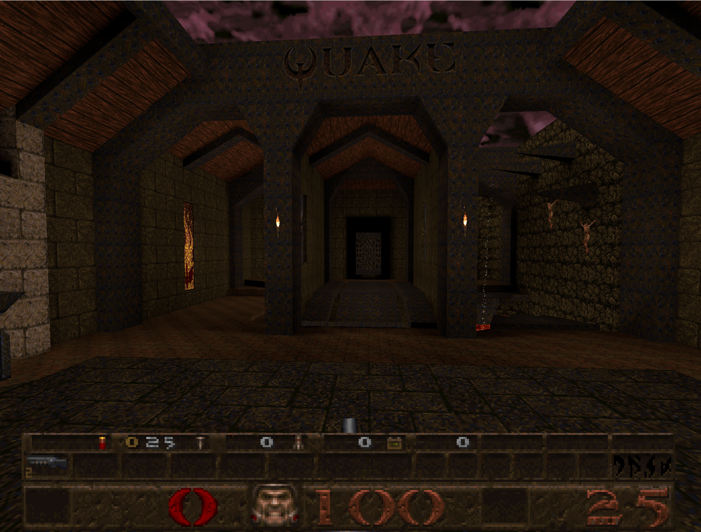
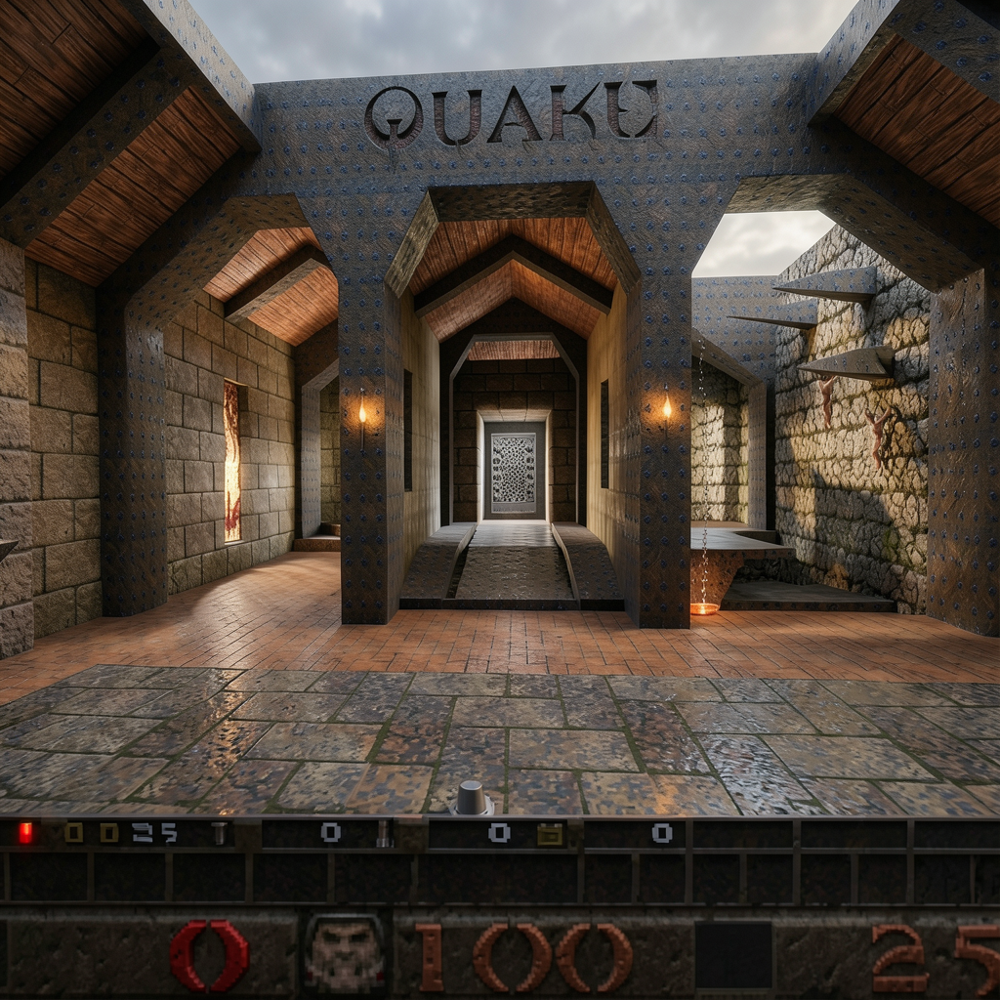

# Visual Fidelity Enhancement Guide

This document describes how to transform the classic Quake look into a modern, visually stunning experience while maintaining real-time performance.

 → 

---

## Console Variables

All visual fidelity features can be toggled individually via console variables using the `cg_hq_` prefix:

| Variable | Default | Description |
|----------|---------|-------------|
| `cg_hq` | `15` | Master toggle (bitmask) for all HQ features |
| `cg_hq_ssr` | `0` | Screen Space Reflections |
| `cg_hq_ao` | `0` | Ambient Occlusion (GTAO) |
| `cg_hq_bloom` | `0` | HDR Bloom |
| `cg_hq_tonemapping` | `0` | HDR Tonemapping |

### Master Bitmask (`cg_hq`)

For convenience, `cg_hq` accepts a bitmask to enable multiple features at once:

```
Bit 0 (1) = SSR
Bit 1 (2) = AO
Bit 2 (4) = Bloom
Bit 3 (8) = Tonemapping
```

**Examples:**
- `cg_hq 15` - Enable all features (default)
- `cg_hq 14` - Enable AO + Bloom + Tonemapping (no SSR)
- `cg_hq 7` - Enable SSR + AO + Bloom (1+2+4)
- `cg_hq 3` - Enable SSR + AO only (1+2)

Individual `cg_hq_xxx` variables override the bitmask when explicitly set.

---

## Techniques

### 1. Screen Space Reflections (SSR) ✅

**What it does:** Creates realistic reflections on floors and wet surfaces by ray-marching in screen space.

**Visual impact:** ★★★★★ (High)
**Performance cost:** ★★★☆☆ (Medium)

#### Implementation Strategy

Use hierarchical ray marching with temporal reprojection for smooth, stable reflections:

```
1. Render G-buffer (depth, normals, roughness)
2. For each pixel, march rays in screen space
3. Use Hi-Z buffer for acceleration
4. Apply temporal reprojection to reduce noise
5. Bilateral blur for edge-preserving smoothing
6. Fallback to environment map where SSR fails
```

#### Key Parameters

| Parameter | Recommended | Description |
|-----------|-------------|-------------|
| `resolution` | `0.5` | Render at half-res, upsample |
| `maxSteps` | `30-50` | Ray march iterations |
| `thickness` | `0.1-0.5` | Depth tolerance for hits |
| `maxDistance` | `50` | Max reflection distance |
| `temporalResolve` | `true` | Smooth across frames |

#### Artifacts & Solutions

- **Missing reflections behind occluders:** Use environment map fallback
- **Staircase edges:** Bilateral blur during upsampling
- **Screen-edge cutoff:** Fade reflections near screen borders

**Reference:** [screen-space-reflections for three.js](https://github.com/0beqz/screen-space-reflections)

---

### 2. Ambient Occlusion (GTAO)

**What it does:** Darkens corners, crevices, and areas where light naturally accumulates less, adding depth and realism.

**Visual impact:** ★★★★★ (High)
**Performance cost:** ★★☆☆☆ (Low-Medium)

#### Why GTAO over SSAO?

Ground Truth Ambient Occlusion uses a **radiometrically-correct** AO equation, producing more accurate results than traditional SSAO. It samples the horizon of the hemisphere around each pixel.

#### Implementation Strategy

```
1. Sample depth buffer in a hemisphere pattern
2. Compute horizon angles using bitmask (32 sectors)
3. Integrate occlusion using visibility bitmask
4. Optional: compute bent normals for indirect lighting
5. Spatial blur to reduce noise
```

#### Performance Benchmarks

| Quality | Resolution | Cost (RTX 3070) |
|---------|-----------|-----------------|
| Low | 1080p | ~0.3ms |
| Medium | 1080p | ~0.4ms |
| High | 1080p | ~0.56ms |
| High | 4K | ~1.4ms |

#### Key Parameters

| Parameter | Recommended | Description |
|-----------|-------------|-------------|
| `radius` | `2.0-4.0` | AO sample radius in world units |
| `samples` | `8-16` | Directions to sample |
| `intensity` | `1.0-1.5` | AO strength multiplier |
| `falloff` | `1.0` | Distance falloff |

**Reference:** [XeGTAO by Intel](https://github.com/GameTechDev/XeGTAO), [GTAO Paper (Activision)](https://www.activision.com/cdn/research/PracticalRealtimeStrategiesTRfinal.pdf)

---

### 3. Global Illumination (Surfels)

**What it does:** Simulates light bouncing off surfaces, filling shadowed areas with colored indirect light.

**Visual impact:** ★★★★★ (Highest)
**Performance cost:** ★★★★☆ (Medium-High)

#### Surfel-Based GI Overview

Surfels (surface elements) are disk-shaped primitives that cache radiance at discrete points on surfaces. This allows **amortizing** expensive lighting calculations across frames.

```
Scene Geometry → Surfel Placement → Ray Tracing → Radiance Cache → Screen Compositing
```

#### Implementation Strategy

1. **Surfel Generation**
   - Place surfels on visible surfaces using screen-space reconstruction
   - Use hierarchical voxel grid for spatial organization
   - Target density: ~1 surfel per 10-20cm² of surface

2. **Radiance Update**
   - Each frame, update a subset of surfels (temporal amortization)
   - Cast rays from surfel positions to gather incoming light
   - Store irradiance using spherical harmonics (9 coefficients)

3. **Radiance Cascade Merging** (optional)
   - Use Radiance Cascades for efficient light propagation
   - 4x directions at each level, merge bottom-up
   - Provides soft, natural penumbras

4. **Screen Compositing**
   - Interpolate surfel radiance to screen pixels
   - Blend with direct lighting

#### Performance Optimization

| Technique | Benefit |
|-----------|---------|
| Temporal amortization | Update 1/8 surfels per frame |
| Surfel LOD | Fewer surfels at distance |
| Probe caching | Reuse results across frames |
| Half-resolution | Compute GI at lower res |

#### Simpler Alternative: Light Probes

For static scenes, pre-baked **irradiance probes** are much cheaper:

- Place probes on a 3D grid throughout the level
- Store diffuse irradiance as spherical harmonics
- Interpolate at runtime (trilinear + tetrahedral)
- Cost: ~16 bytes per probe, negligible runtime cost

**Reference:** [EA SEED GIBS (SIGGRAPH 2021)](https://www.ea.com/seed/news/siggraph21-global-illumination-surfels), [Surfel GI on the Web](https://juretriglav.si/surfel-based-global-illumination-on-the-web/)

---

### 4. HDR Bloom

**What it does:** Creates a soft glow around bright light sources like torches, lava, and weapon fire.

**Visual impact:** ★★★★☆ (High)
**Performance cost:** ★★☆☆☆ (Low)

#### Implementation Strategy

```
1. Render scene to HDR buffer (16-bit float)
2. Extract bright pixels (threshold > 1.0)
3. Downsample bright buffer (mip chain)
4. Apply Gaussian blur at each mip level
5. Upsample and accumulate
6. Additive blend onto scene
```

#### Key Parameters

| Parameter | Recommended | Description |
|-----------|-------------|-------------|
| `threshold` | `0.8-1.0` | Brightness cutoff |
| `intensity` | `0.3-0.5` | Bloom strength |
| `radius` | `0.5-1.0` | Blur spread |
| `levels` | `5-8` | Mip levels for blur |

#### Performance Tips

- Use separable Gaussian blur (horizontal + vertical passes)
- Process at progressively lower resolutions
- Merge with other post-effects in single pass

**Reference:** [LearnOpenGL - Bloom](https://learnopengl.com/Advanced-Lighting/Bloom), [three.js Unreal Bloom](https://threejs.org/examples/webgl_postprocessing_unreal_bloom.html)

---

### 5. Soft Shadows (PCSS)

**What it does:** Creates realistic shadows with soft penumbras that widen with distance from the occluder.

**Visual impact:** ★★★★☆ (High)
**Performance cost:** ★★★☆☆ (Medium)

#### Shadow Map Types Comparison

| Type | Quality | Performance | Use Case |
|------|---------|-------------|----------|
| Basic | Low | Fastest | Debug/Mobile |
| PCF | Medium | Fast | Default |
| PCF Soft | High | Medium | Desktop |
| PCSS | Highest | Slower | High quality |
| VSM | High | Medium | Large scenes |

#### PCSS Implementation

Percentage-Closer Soft Shadows provide **contact-hardening**—shadows are sharp near the occluder and softer further away:

```
1. Blocker search: Find average blocker depth
2. Penumbra estimation: Calculate filter size based on blocker distance
3. PCF filtering: Sample shadow map with variable kernel
```

#### Key Parameters

| Parameter | Recommended | Description |
|-----------|-------------|-------------|
| `shadowMapSize` | `1024-2048` | Shadow map resolution |
| `searchRadius` | `5-10` | Blocker search samples |
| `filterRadius` | `10-20` | PCF filter samples |
| `lightSize` | `1.0-5.0` | Virtual light size |

#### Performance Optimization

- Use cascaded shadow maps for large scenes
- Limit PCSS to nearby lights only
- Use simpler PCF for distant/minor lights

**Reference:** [three.js PCSS Example](https://threejs.org/examples/webgl_shadowmap_pcss.html), [NVIDIA PCSS Whitepaper](https://developer.download.nvidia.com/shaderlibrary/docs/shadow_PCSS.pdf)

---

### 6. Volumetric Lighting

**What it does:** Creates visible light rays (god rays) and atmospheric fog, especially dramatic around torches and windows.

**Visual impact:** ★★★★★ (Highest)
**Performance cost:** ★★★★☆ (High)

#### Implementation Approaches

**A. Radial Blur (Fast)**
```
1. Render occlusion mask (light = white, geometry = black)
2. Apply radial blur from light position
3. Additive blend onto scene
```
- Cost: Low
- Quality: Good for point lights

**B. Ray Marching (Quality)**
```
1. For each pixel, march rays toward camera
2. Sample shadow map at each step
3. Accumulate in-scattered light
4. Apply to scene
```
- Cost: High
- Quality: Excellent, physically accurate

**C. Froxel-Based (Balanced)**
```
1. Divide view frustum into 3D grid (froxels)
2. Compute scattering per froxel
3. Ray march through froxels (few samples)
4. Temporal reprojection for stability
```
- Cost: Medium
- Quality: Very good, used in AAA games

#### Key Parameters

| Parameter | Recommended | Description |
|-----------|-------------|-------------|
| `samples` | `32-64` | Ray march steps |
| `density` | `0.01-0.05` | Fog density |
| `scattering` | `0.5-0.8` | Mie scattering coefficient |
| `maxDistance` | `100` | Max ray distance |

**Reference:** [Volumetric Light Rays (Codrops)](https://tympanus.net/codrops/2022/06/27/volumetric-light-rays-with-three-js/), [GPU Gems 3 - Light Scattering](https://developer.nvidia.com/gpugems/gpugems3/part-ii-light-and-shadows/chapter-13-volumetric-light-scattering-post-process)

---

### 7. HDR Tonemapping ✅

**What it does:** Maps high dynamic range colors to displayable range while preserving detail in highlights and shadows.

**Visual impact:** ★★★☆☆ (Medium)
**Performance cost:** ★☆☆☆☆ (Minimal)

#### Implemented Tonemappers

| Operator | Value | Style | Best For |
|----------|-------|-------|----------|
| ACES Filmic | 0 | Cinematic, contrasty | General use (default) |
| Reinhard | 1 | Soft, preserves color | Bright scenes |
| Uncharted 2 | 2 | Filmic, balanced | Games |

#### ACES Filmic Implementation

```glsl
vec3 ACESFilm(vec3 x) {
    float a = 2.51;
    float b = 0.03;
    float c = 2.43;
    float d = 0.59;
    float e = 0.14;
    return saturate((x*(a*x+b))/(x*(c*x+d)+e));
}
```

#### Key Parameters

| Parameter | Recommended | Description |
|-----------|-------------|-------------|
| `exposure` | `1.0-2.0` | Scene brightness |
| `gamma` | `2.2` | Display gamma |

**Reference:** [Filmic Tonemapping (Matt DesLauriers)](https://medium.com/@mattdesl/filmic-effects-for-webgl-9dab4bc899dc)

---

## Texture Enhancement

### AI Upscaling (ESRGAN)

For dramatically improved texture quality, AI upscaling can transform original 64x64 Quake textures into detailed 256x256 or 512x512 versions:

1. **Extract** original textures from WAD files
2. **Upscale** using ESRGAN with game-trained models
3. **Generate PBR maps** (normal, roughness, AO) from upscaled albedo
4. **Pack** into optimized texture atlases

#### Recommended Models

- **4x_FatalitiV2_ESRGAN** - Trained on game textures
- **4x_GameUpscale** - General purpose game upscaler
- **LDSR** - High quality, slower

**Resource:** [OpenModelDB - Game Texture Models](https://openmodeldb.info/?t=game-textures)

---

## Recommended Presets

### "Fast" (60 FPS on integrated graphics)
```
cg_hq 6  // AO + Bloom only (2+4)
```

### "Balanced" (60 FPS on mid-range GPU)
```
cg_hq 14  // AO + Bloom + Tonemapping (2+4+8)
```

### "Quality" (30-60 FPS on high-end GPU)
```
cg_hq 15  // All features enabled (1+2+4+8)
```

---

## Performance Budget

Target: **16.67ms** per frame (60 FPS)

| Feature | Budget | Notes |
|---------|--------|-------|
| Base rendering | 4-6ms | Scene geometry + textures |
| SSR | 2-3ms | Half resolution |
| GTAO | 0.5-1ms | 8-16 samples |
| Bloom | 0.5-1ms | 5 mip levels |
| Soft Shadows | 1-2ms | Per shadow-casting light |
| Volumetric | 2-4ms | Froxel or radial blur |
| Tonemapping | 0.1ms | Simple math |
| **Total** | **10-17ms** | Within budget |

### Performance Tips

1. **Render at lower resolution** - Most effects look fine at 0.5x
2. **Temporal amortization** - Spread work across frames
3. **Early-out optimizations** - Skip pixels that don't need effects
4. **Level-of-detail** - Reduce quality with distance
5. **Combine passes** - Merge effects into fewer draw calls

---

## Implementation Priority

For best visual improvement with minimal performance cost:

1. ✅ **GTAO** - Huge visual improvement, low cost - `cg_hq_ao 1`
2. ✅ **Bloom** - Makes lights pop, very cheap - `cg_hq_bloom 1`
3. ✅ **Tonemapping** - Better colors, almost free - `cg_hq_tonemapping 1`
4. ✅ **SSR** - Impressive on floors/water - `cg_hq_ssr 1`

Future features (not yet implemented):
- **Volumetric** - Atmospheric but expensive
- **Soft Shadows** - Contact-hardening PCSS
- **GI** - Most complex, save for last

---

## Sources

### Screen Space Reflections
- [screen-space-reflections (GitHub)](https://github.com/0beqz/screen-space-reflections)
- [three.js SSR Example](https://threejs.org/examples/webgl_postprocessing_ssr.html)

### Ambient Occlusion
- [XeGTAO - Intel](https://github.com/GameTechDev/XeGTAO)
- [GTAO Paper - Activision](https://www.activision.com/cdn/research/PracticalRealtimeStrategiesTRfinal.pdf)
- [SSILVB - Cybereality](https://cybereality.com/screen-space-indirect-lighting-with-visibility-bitmask-improvement-to-gtao-ssao-real-time-ambient-occlusion-algorithm-glsl-shader-implementation/)

### Global Illumination
- [EA SEED GIBS (SIGGRAPH 2021)](https://www.ea.com/seed/news/siggraph21-global-illumination-surfels)
- [Surfel Radiance Cascades (GitHub)](https://github.com/mxcop/src-dgi)
- [Surfel GI on the Web](https://juretriglav.si/surfel-based-global-illumination-on-the-web/)
- [Radiance Cascades - GM Shaders](https://mini.gmshaders.com/p/radiance-cascades)
- [SIGGRAPH 2024 Advances](https://advances.realtimerendering.com/s2024/index.html)

### Bloom & Tonemapping
- [LearnOpenGL - Bloom](https://learnopengl.com/Advanced-Lighting/Bloom)
- [pmndrs/postprocessing](https://github.com/pmndrs/postprocessing)
- [Filmic Effects (Matt DesLauriers)](https://medium.com/@mattdesl/filmic-effects-for-webgl-9dab4bc899dc)

### Shadows
- [three.js PCSS Example](https://threejs.org/examples/webgl_shadowmap_pcss.html)
- [NVIDIA PCSS Integration](https://developer.download.nvidia.com/shaderlibrary/docs/shadow_PCSS.pdf)

### Volumetric Lighting
- [Volumetric Light Rays (Codrops)](https://tympanus.net/codrops/2022/06/27/volumetric-light-rays-with-three-js/)
- [Volumetric Light Scattering (Medium)](https://medium.com/@andrew_b_berg/volumetric-light-scattering-in-three-js-6e1850680a41)
- [Maxime Heckel - Raymarching Volumetrics](https://blog.maximeheckel.com/posts/shaping-light-volumetric-lighting-with-post-processing-and-raymarching/)

### Light Probes & IBL
- [LearnOpenGL - Diffuse Irradiance](https://learnopengl.com/PBR/IBL/Diffuse-irradiance)
- [DDGI Overview](https://morgan3d.github.io/articles/2019-04-01-ddgi/overview.html)

### Texture Upscaling
- [OpenModelDB - Game Textures](https://openmodeldb.info/?t=game-textures)
- [AI Upscaling Article (PC Gamer)](https://www.pcgamer.com/AI-upscale-mod-list/)

---

## Implementation Reference

For detailed implementation patterns, debugging techniques, and Three.js gotchas, see:

**[docs/RENDERING_PIPELINE.md](../RENDERING_PIPELINE.md)**

This includes:
- Render loop overview and integration points
- Three.js shader gotchas (reserved uniform names, silent failures)
- Debug workflow for post-processing effects
- Render target best practices
- Compositing without clearing
- Position reconstruction from depth
- Circular dependency prevention

### Quick Reference: HQ Feature Bitmask

The `cg_hq` cvar uses a bitmask for bulk enabling:

```
Bit 0 (1) = SSR
Bit 1 (2) = AO
Bit 2 (4) = Bloom
Bit 3 (8) = Tonemapping
```

### Console Commands

**SSR (Screen Space Reflections):**
```
cg_hq_ssr 1                # Enable SSR
cg_hq_ssr_maxdistance 500  # Max reflection distance (Quake units)
cg_hq_ssr_thickness 10     # Depth tolerance (Quake units)
cg_hq_ssr_intensity 1.0    # Reflection strength
```

**Ambient Occlusion (GTAO):**
```
cg_hq_ao 1             # Enable GTAO
cg_hq_ao_radius 6      # AO radius (Quake units)
cg_hq_ao_intensity 0.3 # AO strength
```

**HDR Bloom:**
```
cg_hq_bloom 1              # Enable bloom
cg_hq_bloom_threshold 0.15 # Brightness cutoff
cg_hq_bloom_intensity 0.7  # Bloom strength
cg_hq_bloom_radius 0.3     # Blur spread
```

**HDR Tonemapping:**
```
cg_hq_tonemapping 1               # Enable tonemapping
cg_hq_tonemapping_operator 0      # 0=ACES, 1=Reinhard, 2=Cineon, 3=AgX, 4=Neutral
cg_hq_tonemapping_exposure 3.0    # Scene exposure
```

**Master Bitmask:**
```
cg_hq 1                # Enable SSR via bitmask
cg_hq 2                # Enable AO via bitmask
cg_hq 4                # Enable Bloom via bitmask
cg_hq 8                # Enable Tonemapping via bitmask
cg_hq 15               # Enable all features (default)
```
